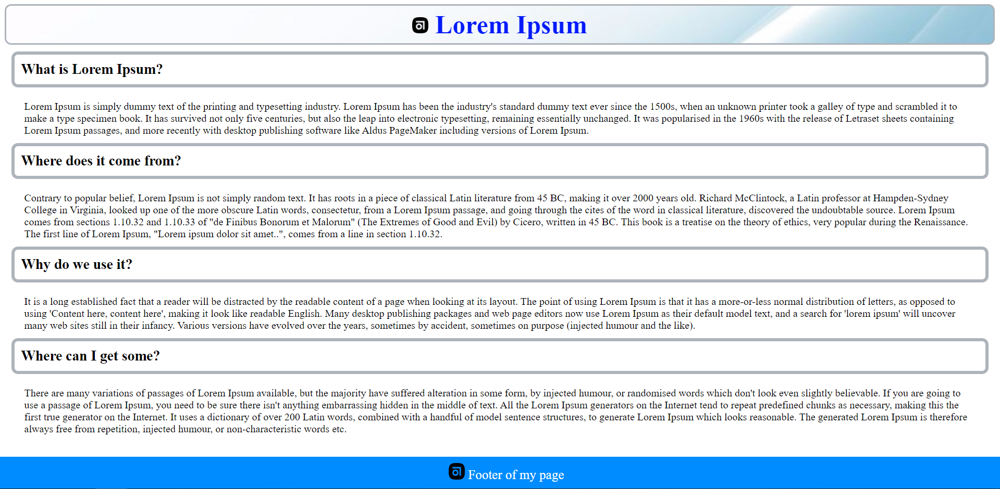

# Model-driven Development Environment

It's a example of a create a web page with CSS and basic structure using Model-driven engineering (MDE). 

The structure of this project:
+ PrograWeb
    + model
        + ecore
        + genmodel
        + xmi
+ webPageAcceleo
    + tasks
        + page generated .html
        + generate .xml
    

The other folders was generated using the model in the folder PrograWeb

:construction_worker: The result of this model is locate in the folder webPageAcceleo/result/ and a screenshot of this result is below

